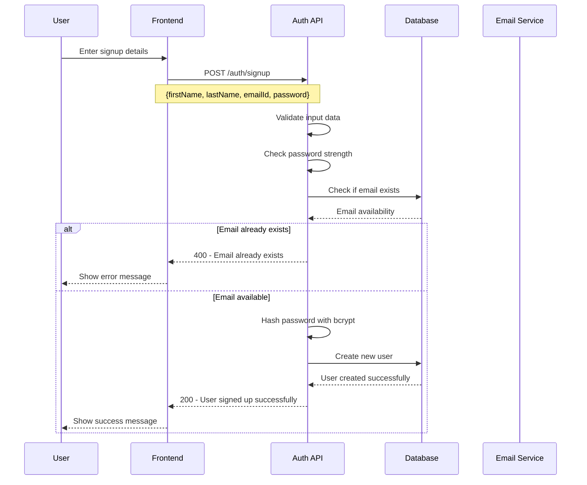
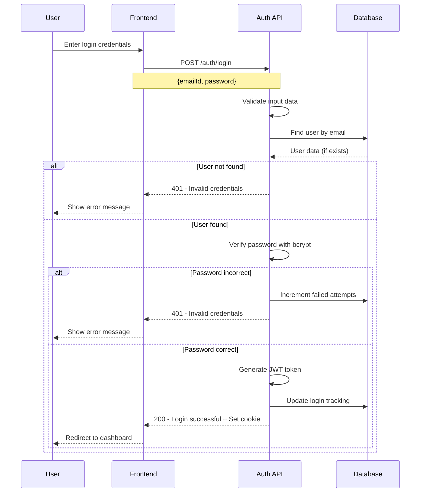
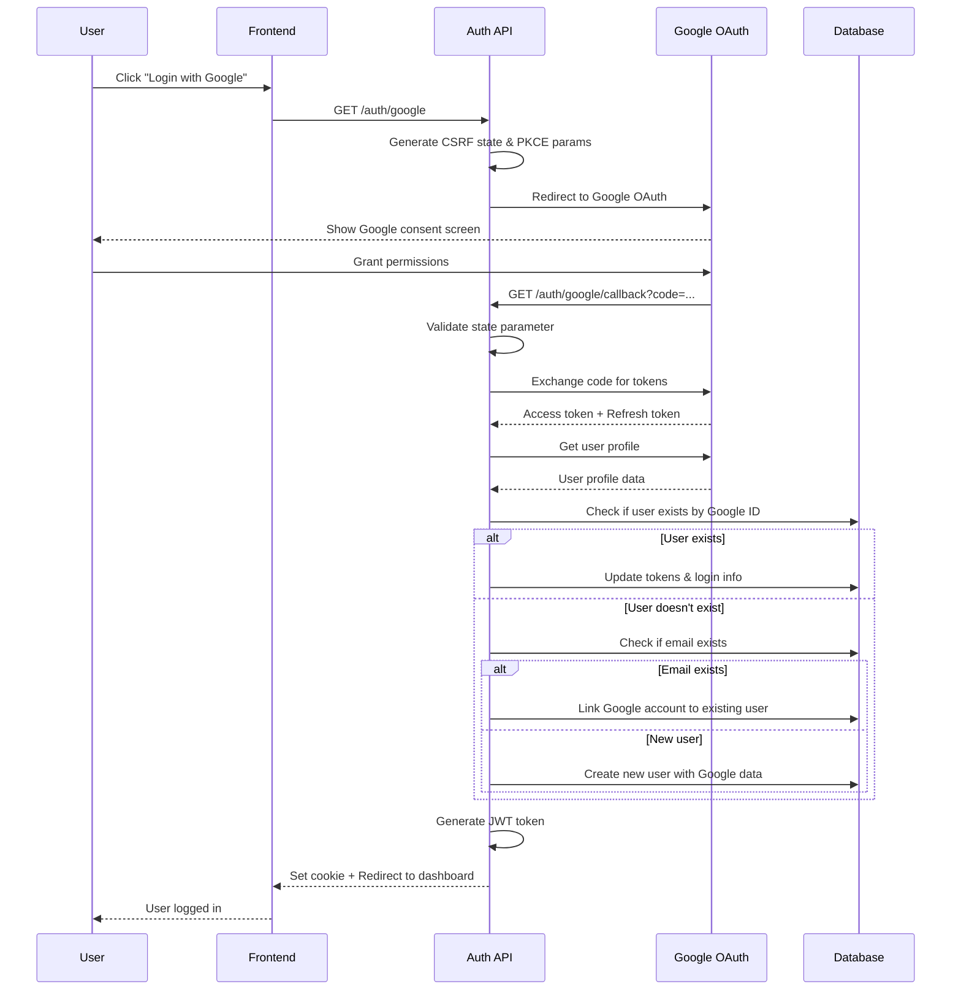
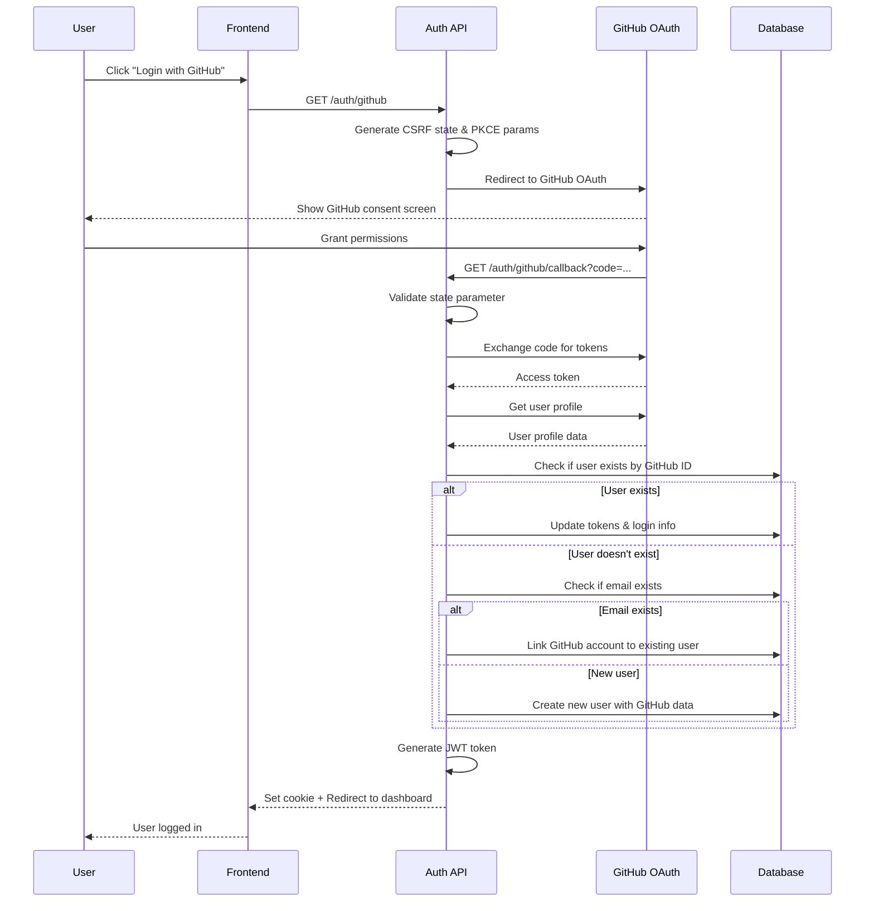

# Authentication Flow Documentation

This document explains the complete authentication flow for the PerfectAI application, covering both manual (email/password) and OAuth authentication methods for login and signup.

## Table of Contents
- [Manual Authentication Flow](#manual-authentication-flow)
  - [Signup Flow](#signup-flow)
  - [Login Flow](#login-flow)
- [OAuth Authentication Flow](#oauth-authentication-flow)
  - [Google OAuth Flow](#google-oauth-flow)
  - [GitHub OAuth Flow](#github-oauth-flow)
- [Authentication States](#authentication-states)
- [Security Features](#security-features)
- [API Endpoints Reference](#api-endpoints-reference)

---

## Manual Authentication Flow

### Signup Flow

#### 1. User Registration Process



#### 2. Signup API Details

**Endpoint**: `POST /auth/signup`

**Request Body**:
```json
{
  "firstName": "John",
  "lastName": "Doe", 
  "emailId": "john.doe@example.com",
  "password": "SecurePass123!"
}
```

**Validation Rules**:
- **firstName**: Required, string
- **lastName**: Required, string  
- **emailId**: Required, valid email format
- **password**: Required, minimum 8 characters with:
  - At least one uppercase letter
  - At least one lowercase letter
  - At least one number
  - At least one special character

**Response Examples**:

**Success (200)**:
```json
{
  "success": true,
  "message": "User signed up successfully",
  "data": {
    "user": {
      "id": "64f8a1b2c3d4e5f6a7b8c9d0",
      "firstName": "John",
      "lastName": "Doe",
      "emailId": "john.doe@example.com"
    }
  }
}
```

**Error (400)**:
```json
{
  "success": false,
  "error": "Email already exists"
}
```

#### 3. Signup Security Features

- **Password Hashing**: Uses bcrypt with configurable salt rounds (default: 10)
- **Email Uniqueness**: Prevents duplicate email registrations
- **Input Validation**: Server-side validation of all fields
- **Rate Limiting**: Prevents spam registrations (if implemented)

---

### Login Flow

#### 1. User Login Process



#### 2. Login API Details

**Endpoint**: `POST /auth/login`

**Request Body**:
```json
{
  "emailId": "john.doe@example.com",
  "password": "SecurePass123!"
}
```

**Response Examples**:

**Success (200)**:
```json
{
  "success": true,
  "message": "User logged in successfully",
  "data": {
    "user": {
      "id": "64f8a1b2c3d4e5f6a7b8c9d0",
      "firstName": "John",
      "lastName": "Doe",
      "emailId": "john.doe@example.com",
      "lastLogin": "2024-01-15T10:30:00.000Z",
      "loginCount": 5
    }
  }
}
```

**Error (401)**:
```json
{
  "success": false,
  "error": "Invalid credentials"
}
```

#### 3. Login Security Features

- **Rate Limiting**: 5 attempts per 15 minutes
- **Account Locking**: Account locked after 5 failed attempts for 30 minutes
- **Login Tracking**: Records IP address, timestamp, and attempt count
- **Secure Cookies**: JWT token stored in httpOnly, secure cookies
- **Password Verification**: Uses bcrypt to verify passwords

---

## OAuth Authentication Flow

### Google OAuth Flow

#### 1. Google OAuth Process



#### 2. Google OAuth API Details

**Initiation Endpoint**: `GET /auth/google`

**Process**:
1. Generates CSRF state parameter for security
2. Generates PKCE parameters for additional security
3. Redirects to Google OAuth consent screen
4. User grants permissions
5. Google redirects back to callback URL

**Callback Endpoint**: `GET /auth/google/callback`

**Process**:
1. Validates state parameter (CSRF protection)
2. Exchanges authorization code for access/refresh tokens
3. Fetches user profile from Google
4. Creates or updates user in database
5. Generates JWT token and sets secure cookie
6. Redirects to dashboard

**User Profile Data Retrieved**:
```json
{
  "id": "123456789",
  "emails": [{"value": "user@gmail.com"}],
  "name": {
    "givenName": "John",
    "familyName": "Doe"
  },
  "photos": [{"value": "https://profile-pic-url"}]
}
```

#### 3. Google OAuth Security Features

- **CSRF Protection**: State parameter validation
- **PKCE**: Proof Key for Code Exchange for additional security
- **Token Management**: Stores access and refresh tokens
- **Account Linking**: Links Google account to existing email accounts
- **Scope Management**: Requests only necessary permissions (profile, email)

---

### GitHub OAuth Flow

#### 1. GitHub OAuth Process



#### 2. GitHub OAuth API Details

**Initiation Endpoint**: `GET /auth/github`

**Process**:
1. Generates CSRF state parameter
2. Generates PKCE parameters
3. Redirects to GitHub OAuth consent screen
4. User grants permissions
5. GitHub redirects back to callback URL

**Callback Endpoint**: `GET /auth/github/callback`

**Process**:
1. Validates state parameter
2. Exchanges authorization code for access token
3. Fetches user profile from GitHub
4. Creates or updates user in database
5. Generates JWT token and sets secure cookie
6. Redirects to dashboard

**User Profile Data Retrieved**:
```json
{
  "id": 12345678,
  "username": "johndoe",
  "displayName": "John Doe",
  "emails": [{"value": "user@example.com"}],
  "profileUrl": "https://github.com/johndoe"
}
```

#### 3. GitHub OAuth Security Features

- **CSRF Protection**: State parameter validation
- **PKCE**: Additional security layer
- **Token Management**: Stores access tokens
- **Account Linking**: Links GitHub account to existing email accounts
- **Scope Management**: Requests only necessary permissions (user:email)

---

## Authentication States

### User Authentication States

1. **Unauthenticated**: No valid session or token
2. **Authenticated**: Valid JWT token present
3. **OAuth Linked**: User has linked OAuth accounts
4. **Account Locked**: Too many failed login attempts

### Session Management

- **JWT Tokens**: Stateless authentication tokens
- **Cookie Storage**: Secure httpOnly cookies
- **Token Expiry**: Configurable token expiration
- **Refresh Mechanism**: Token refresh endpoint available

---

## Security Features

### General Security

- **Rate Limiting**: Prevents brute force attacks
- **Input Validation**: Server-side validation of all inputs
- **Password Hashing**: bcrypt with configurable salt rounds
- **Secure Cookies**: httpOnly, secure, sameSite cookies
- **CSRF Protection**: State parameters for OAuth flows
- **PKCE**: Additional OAuth security layer

### Account Security

- **Account Locking**: Temporary lockout after failed attempts
- **Login Tracking**: IP address and timestamp logging
- **Password Strength**: Enforced strong password requirements
- **Email Verification**: OAuth emails are automatically verified

### OAuth Security

- **Token Management**: Secure storage of OAuth tokens
- **Account Linking**: Safe linking of OAuth accounts
- **Scope Limitation**: Minimal required permissions
- **State Validation**: CSRF protection in OAuth flows

---

## API Endpoints Reference

### Authentication Endpoints

| Method | Endpoint | Description | Auth Required |
|--------|----------|-------------|---------------|
| POST | `/auth/signup` | User registration | No |
| POST | `/auth/login` | User login | No |
| POST | `/auth/logout` | User logout | Yes |
| POST | `/auth/logout/oauth` | OAuth logout with token revocation | Yes |
| GET | `/auth/google` | Initiate Google OAuth | No |
| GET | `/auth/google/callback` | Google OAuth callback | No |
| GET | `/auth/github` | Initiate GitHub OAuth | No |
| GET | `/auth/github/callback` | GitHub OAuth callback | No |
| GET | `/auth/user-info` | Get current user info | Yes |
| POST | `/auth/unlink/:provider` | Unlink OAuth provider | Yes |
| POST | `/auth/refresh-token` | Refresh JWT token | Yes |

### Password Reset Endpoints

| Method | Endpoint | Description | Auth Required |
|--------|----------|-------------|---------------|
| GET | `/auth/forgot-password` | Forgot password page | No |
| POST | `/auth/forgot-password` | Send reset email | No |
| GET | `/auth/reset-password/:token` | Reset password page | No |
| POST | `/auth/reset-password/:token` | Reset password | No |

### Error Responses

All endpoints return consistent error responses:

```json
{
  "success": false,
  "error": "Error message description"
}
```

### Success Responses

All endpoints return consistent success responses:

```json
{
  "success": true,
  "message": "Success message",
  "data": {
    // Response data (if applicable)
  }
}
```

---

## Frontend Integration Examples

### Manual Login Form

```javascript
// Login form submission
const handleLogin = async (formData) => {
  try {
    const response = await fetch('/auth/login', {
      method: 'POST',
      headers: {
        'Content-Type': 'application/json',
      },
      body: JSON.stringify({
        emailId: formData.email,
        password: formData.password
      })
    });
    
    const data = await response.json();
    
    if (data.success) {
      // JWT token is automatically set as cookie
      window.location.href = '/dashboard';
    } else {
      showError(data.error);
    }
  } catch (error) {
    showError('Login failed. Please try again.');
  }
};
```

### OAuth Login Buttons

```html
<!-- Google OAuth -->
<a href="/auth/google" class="oauth-btn google">
  
  Continue with Google
</a>

<!-- GitHub OAuth -->
<a href="/auth/github" class="oauth-btn github">
  
  Continue with GitHub
</a>
```

### Check Authentication Status

```javascript
// Check if user is authenticated
const checkAuth = async () => {
  try {
    const response = await fetch('/auth/user-info', {
      credentials: 'include' // Include cookies
    });
    
    const data = await response.json();
    
    if (data.success) {
      // User is authenticated
      displayUserInfo(data.user);
    } else {
      // User is not authenticated
      redirectToLogin();
    }
  } catch (error) {
    redirectToLogin();
  }
};
```

---

## Database Schema

### User Model Fields

```javascript
{
  // Basic Info
  firstName: String,
  lastName: String,
  emailId: String (unique),
  password: String (hashed),
  
  // OAuth Fields
  googleId: String,
  githubId: String,
  googleAccessToken: String,
  googleRefreshToken: String,
  githubAccessToken: String,
  googleTokenExpiry: Date,
  
  // Profile URLs
  googleProfileUrl: String,
  githubProfileUrl: String,
  githubUsername: String,
  
  // Authentication Tracking
  provider: String, // 'local', 'google', 'github'
  lastOAuthProvider: String,
  oauthAccountsLinked: [String],
  oauthScopes: [String],
  oauthConsentDate: Date,
  
  // Security
  isEmailVerified: Boolean,
  failedLoginAttempts: Number,
  isLocked: Boolean,
  lockUntil: Date,
  
  // Login Tracking
  lastLogin: Date,
  loginIP: String,
  loginCount: Number,
  
  // Password Reset
  resetPasswordToken: String,
  resetPasswordExpiry: Date,
  
  // Timestamps
  createdAt: Date,
  updatedAt: Date
}
```

---

This documentation provides a complete overview of the authentication system, including all flows, security features, and implementation details for both manual and OAuth authentication methods.
