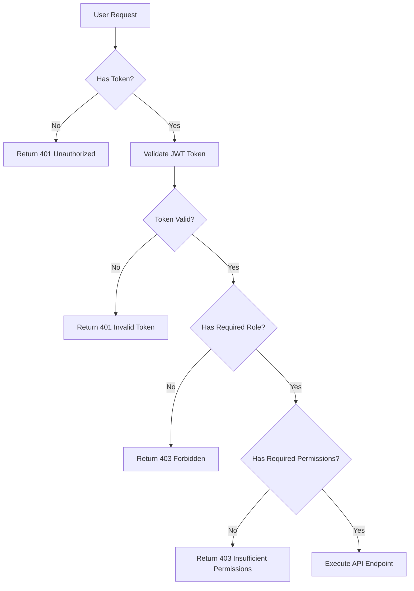

# PerfectAI Swagger API Documentation

## 📋 Table of Contents
- [Overview](#overview)
- [How Swagger Works](#how-swagger-works)
- [Accessing the API Documentation](#accessing-the-api-documentation)
- [Authorization System](#authorization-system)
- [API Categories](#api-categories)
- [Production-Ready APIs](#production-ready-apis)
- [Testing APIs](#testing-apis)
- [Troubleshooting](#troubleshooting)

## 🎯 Overview

PerfectAI provides a comprehensive REST API for AI-powered test case generation with advanced authentication, admin management, and audit capabilities. The API is fully documented using Swagger UI for easy testing and integration.

**Base URL:** `http://localhost:5000`  
**API Documentation:** `http://localhost:5000/api-docs`  
**API Version:** 1.0.0

## 🔧 How Swagger Works

### What is Swagger?
Swagger (OpenAPI) is a specification for building and documenting REST APIs. It provides:
- **Interactive API Documentation** - Test APIs directly in the browser
- **Code Generation** - Generate client SDKs automatically
- **API Validation** - Ensure API contracts are followed
- **Authorization Testing** - Test authenticated endpoints

### Our Implementation
- **Custom HTML Interface** - Uses CDN resources for reliability
- **JWT Token Validation** - Real server-side token verification
- **Admin Authorization** - Role-based access control
- **Interactive Testing** - Try APIs directly from the documentation

## 🌐 Accessing the API Documentation

1. **Start the Server:**
   ```bash
   cd backend
   npm run dev
   ```

2. **Open Swagger UI:**
   - Navigate to: `http://localhost:5000/api-docs`
   - You'll see the interactive API documentation

3. **Features Available:**
   - ✅ All API endpoints with descriptions
   - ✅ Request/response schemas
   - ✅ Try-it-out functionality
   - ✅ Authorization testing
   - ✅ Real-time API testing

## 🔐 Authorization System

### How Authorization Works

1. **Get Admin Token:**
   ```bash
   POST /auth/login
   {
     "emailId": "admin@example.com",
     "password": "AdminPass123!"
   }
   ```

2. **Copy JWT Token:**
   - From the response, copy the `token` field
   - This is your Bearer token for admin APIs

3. **Authorize in Swagger:**
   - Click "🔑 Admin Login" button in Swagger UI
   - Paste your JWT token
   - System validates token with real API call
   - Status shows "✅ Admin Authorized" if valid

4. **Test Admin APIs:**
   - All admin endpoints now work with your token
   - Token is automatically included in requests

### Authorization Levels

| Level | Access | Endpoints |
|-------|--------|-----------|
| **Public** | No auth required | `/auth/signup`, `/auth/login`, `/api/test-generation/*` |
| **User** | Valid user token | `/auth/dashboard`, `/auth/user`, `/auth/logout` |
| **Admin** | Admin role required | `/admin/users/*`, `/admin/audit/*` |
| **Super Admin** | Super admin role required | `/admin/users/create-admin`, `/admin/users/promote` |

## 📚 API Categories

### 1. 🔐 Authentication APIs
**Base Path:** `/auth`

| Endpoint | Method | Description | Auth Required |
|----------|--------|-------------|---------------|
| `/auth/signup` | POST | Register new user | No |
| `/auth/login` | POST | User login | No |
| `/auth/logout` | POST | User logout | Yes |
| `/auth/dashboard` | GET | Get user dashboard | Yes |
| `/auth/user` | GET | Get user info | Yes |
| `/auth/refresh` | POST | Refresh JWT token | No |

### 2. 👥 Admin User Management
**Base Path:** `/admin/users`

| Endpoint | Method | Description | Auth Required |
|----------|--------|-------------|---------------|
| `/admin/users/create-admin` | POST | Create new admin | Super Admin |
| `/admin/users/promote` | POST | Promote user to admin | Super Admin |
| `/admin/users/list` | GET | List all admins | Admin |
| `/admin/users/:userId` | GET | Get admin details | Admin |
| `/admin/users/:userId/permissions` | PUT | Update permissions | Admin |
| `/admin/users/:userId/remove` | DELETE | Remove admin access | Super Admin |

### 3. 📊 Admin Audit & Monitoring
**Base Path:** `/admin/audit`

| Endpoint | Method | Description | Auth Required |
|----------|--------|-------------|---------------|
| `/admin/audit/logs` | GET | Get audit logs | Admin |
| `/admin/audit/high-risk` | GET | Get high-risk actions | Admin |
| `/admin/audit/summary` | GET | Get activity summary | Admin |
| `/admin/audit/export` | GET | Export audit logs | Admin |
| `/admin/audit/statistics` | GET | Get audit statistics | Admin |

### 4. 🤖 OpenAI Administration
**Base Path:** `/admin/openai`

| Endpoint | Method | Description | Auth Required |
|----------|--------|-------------|---------------|
| `/admin/openai/dashboard` | GET | OpenAI usage dashboard | Admin |
| `/admin/openai/top-users` | GET | Top users by usage | Admin |
| `/admin/openai/user/:userId/stats` | GET | User-specific stats | Admin |
| `/admin/openai/user/:userId/history` | GET | User usage history | Admin |

### 5. 🧪 Test Generation APIs
**Base Path:** `/api/test-generation`

| Endpoint | Method | Description | Auth Required |
|----------|--------|-------------|---------------|
| `/api/test-generation/test` | GET | API health check | No |
| `/api/test-generation/generate` | POST | Generate test cases | No |
| `/api/test-generation/generate-streaming` | POST | Streaming generation | No |
| `/api/test-generation/context-windows` | GET | Get context windows | Yes |
| `/api/test-generation/generate-with-context` | POST | Context-based generation | Yes |

## 🚀 Production-Ready APIs

### Complete API List for Production

#### Authentication & User Management
```yaml
POST /auth/signup
POST /auth/login
POST /auth/logout
GET  /auth/dashboard
GET  /auth/user
POST /auth/refresh
```

#### Admin Management
```yaml
POST /admin/users/create-admin
POST /admin/users/promote
GET  /admin/users/list
GET  /admin/users/:userId
PUT  /admin/users/:userId/permissions
DELETE /admin/users/:userId/remove
```

#### Audit & Monitoring
```yaml
GET /admin/audit/logs
GET /admin/audit/high-risk
GET /admin/audit/summary
GET /admin/audit/export
GET /admin/audit/statistics
GET /admin/audit/admin/:adminId
GET /admin/audit/category/:category
GET /admin/audit/severity/:severity
GET /admin/audit/recent
```

#### OpenAI Administration
```yaml
GET /admin/openai/dashboard
GET /admin/openai/top-users
GET /admin/openai/user/:userId/stats
GET /admin/openai/user/:userId/history
```

#### Test Generation
```yaml
GET  /api/test-generation/test
POST /api/test-generation/generate
POST /api/test-generation/generate-streaming
GET  /api/test-generation/context-windows
POST /api/test-generation/generate-with-context
```

## 🧪 Testing APIs

### 1. Test Public APIs (No Auth Required)

**Example: User Registration**
```bash
POST /auth/signup
Content-Type: application/json

{
  "firstName": "John",
  "lastName": "Doe",
  "emailId": "john.doe@example.com",
  "password": "SecurePass123!"
}
```

**Example: User Login**
```bash
POST /auth/login
Content-Type: application/json

{
  "emailId": "john.doe@example.com",
  "password": "SecurePass123!"
}
```

### 2. Test Admin APIs (Auth Required)

**Step 1: Get Admin Token**
```bash
POST /auth/login
Content-Type: application/json

{
  "emailId": "admin@example.com",
  "password": "AdminPass123!"
}
```

**Step 2: Use Token in Admin Requests**
```bash
GET /admin/users/list
Authorization: Bearer YOUR_JWT_TOKEN_HERE
```

### 3. Test in Swagger UI

1. **Open Swagger UI:** `http://localhost:5000/api-docs`
2. **Click "🔑 Admin Login"** button
3. **Enter your JWT token**
4. **Status shows "✅ Admin Authorized"**
5. **Test any admin endpoint directly**

## 🔧 Authorization Implementation Details

### JWT Token Structure
```json
{
  "userId": "64f8a1b2c3d4e5f6a7b8c9d0",
  "emailId": "admin@example.com",
  "role": "superadmin",
  "isAdmin": true,
  "permissions": [
    "view_analytics",
    "manage_users",
    "view_audit_logs",
    "export_data"
  ],
  "isAdminUser": true,
  "iat": 1693123456,
  "exp": 1693209856
}
```

### Permission System
```yaml
Admin Permissions:
  - view_analytics: View analytics and statistics
  - manage_users: Manage user accounts
  - view_audit_logs: View audit logs
  - export_data: Export data and reports
  - manage_admins: Manage admin users
  - system_settings: Modify system settings

Super Admin Permissions:
  - All admin permissions
  - create_admins: Create new admin users
  - promote_users: Promote users to admin
  - remove_admins: Remove admin access
```

### Authorization Flow


## 🛠️ Troubleshooting

### Common Issues

#### 1. "❌ Invalid token" Error
**Cause:** JWT token is malformed or expired
**Solution:** 
- Get a fresh token by logging in again
- Check if token is copied correctly

#### 2. "❌ Access denied" Error
**Cause:** User doesn't have admin privileges
**Solution:**
- Ensure you're logged in with an admin account
- Check user role in database

#### 3. "❌ Token validation failed" Error
**Cause:** Network error or server issue
**Solution:**
- Check if server is running
- Verify API endpoint is accessible
- Check browser console for errors

#### 4. Swagger UI Not Loading
**Cause:** Static assets not loading
**Solution:**
- Check server is running on port 5000
- Clear browser cache
- Check browser console for errors

### Debug Steps

1. **Check Server Status:**
   ```bash
   curl http://localhost:5000/health
   ```

2. **Verify API Endpoints:**
   ```bash
   curl http://localhost:5000/api-docs.json
   ```

3. **Test Token Manually:**
   ```bash
   curl -H "Authorization: Bearer YOUR_TOKEN" \
        http://localhost:5000/admin/users/list
   ```

## 📝 API Response Examples

### Successful Login Response
```json
{
  "success": true,
  "message": "Login successful",
  "data": {
    "user": {
      "id": "64f8a1b2c3d4e5f6a7b8c9d0",
      "firstName": "Admin",
      "lastName": "User",
      "emailId": "admin@example.com",
      "role": "superadmin",
      "isAdmin": true,
      "permissions": ["view_analytics", "manage_users"]
    },
    "token": "eyJhbGciOiJIUzI1NiIsInR5cCI6IkpXVCJ9...",
    "refreshToken": "abc123def456..."
  }
}
```

### Admin Users List Response
```json
{
  "success": true,
  "data": {
    "users": [
      {
        "_id": "64f8a1b2c3d4e5f6a7b8c9d0",
        "firstName": "Admin",
        "lastName": "User",
        "emailId": "admin@example.com",
        "role": "superadmin",
        "isActive": true,
        "permissions": ["view_analytics", "manage_users"],
        "createdAt": "2023-08-28T10:30:00Z"
      }
    ],
    "pagination": {
      "page": 1,
      "limit": 50,
      "total": 1,
      "pages": 1
    }
  }
}
```

## 🎯 Best Practices

### For API Testing
1. **Always use HTTPS in production**
2. **Store tokens securely**
3. **Implement proper error handling**
4. **Use appropriate HTTP status codes**
5. **Validate input data**

### For Development
1. **Test all endpoints before deployment**
2. **Document any custom endpoints**
3. **Keep API versioning consistent**
4. **Monitor API usage and performance**
5. **Implement rate limiting**

---

## 📞 Support

For API support and questions:
- **Email:** support@perfectai.com
- **Documentation:** `http://localhost:5000/api-docs`
- **Health Check:** `http://localhost:5000/health`

---

*This documentation is automatically generated and updated with each API change.*
